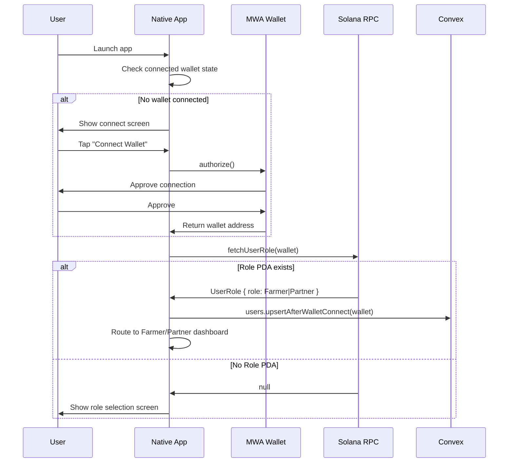
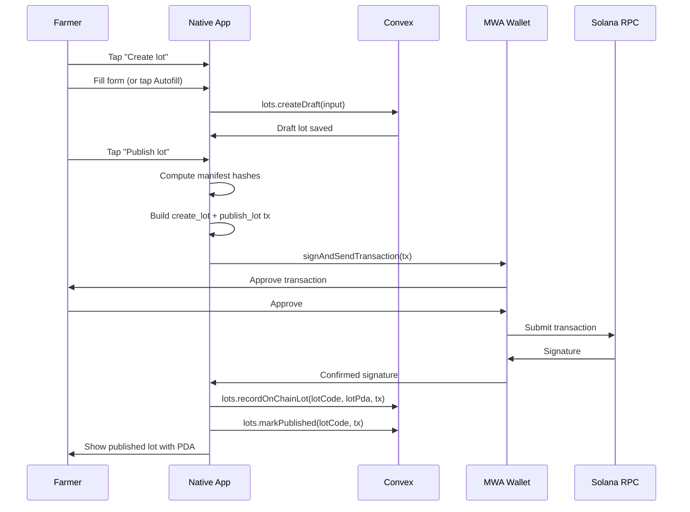
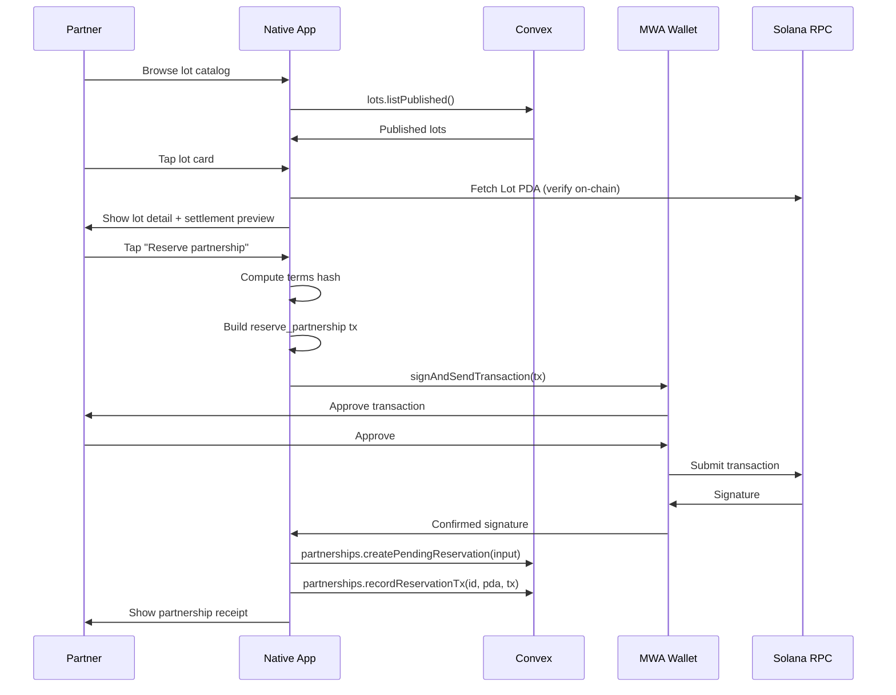
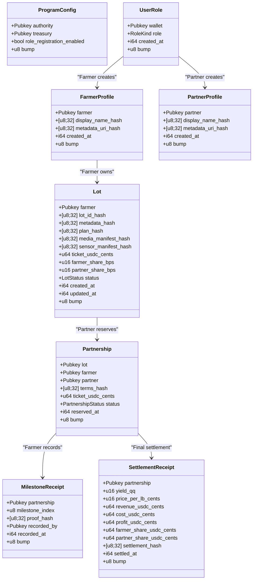
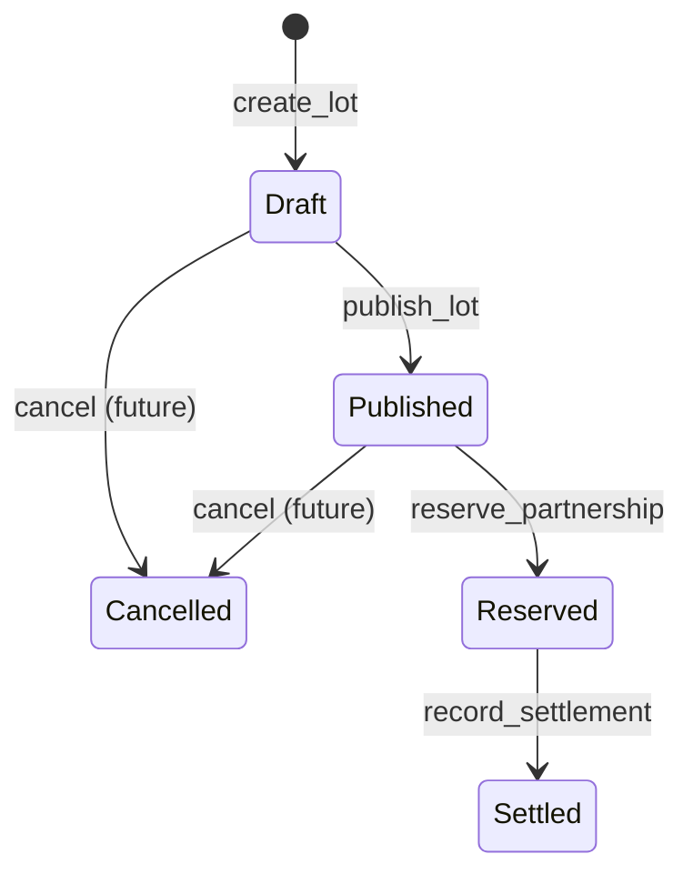
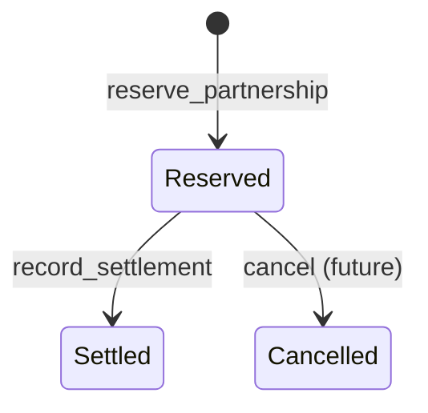
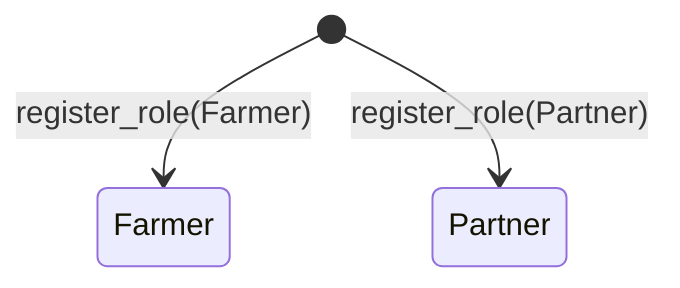

# Design Document: Harvverse Solana Mobile App

## Overview

Harvverse is a Solana Mobile dApp for connecting coffee farmers with investment partners through on-chain role registration, lot marketplace, and partnership settlement. The system uses a hybrid architecture: Solana devnet stores compact role, lot, and partnership state as the source of truth, while Convex provides the off-chain backend for rich data (profiles, media, plans, sensor snapshots). The Expo React Native Android app connects via Mobile Wallet Adapter (MWA) and routes users deterministically based on their on-chain role PDA.

The design replaces the existing template Vault program at `Bwedfg1JZvA5HfV5dCA2cyJhQf2Bkbop6K8eMdt1vKWP` with a new `harvverse` Anchor program. The `@repo/solana-client` package is extended with Codama-generated client code, PDA derivation helpers, transaction builders, and manifest hash utilities. The native app is restructured from a flat `app/index.tsx` into a full expo-router layout with role-based route groups.

**Monorepo structure:** The Convex backend is the `@havverse/backend` workspace package at `packages/backend/`. It is already initialized and wired into `apps/native` as a workspace dependency. Convex functions live in `packages/backend/convex/`; the native app imports them via `@havverse/backend/convex/_generated/api`.

AI agent chat and x402 paid endpoints are explicitly out of scope for this design.

## Architecture

### High-Level System Diagram

```mermaid
graph TB
    subgraph "Mobile Device"
        APP[Expo React Native App<br/>apps/native]
        MWA_WALLET[MWA-Compatible Wallet<br/>e.g. Phantom, Solflare]
    end

    subgraph "Solana Devnet"
        PROGRAM[Harvverse Anchor Program<br/>programs/anchor]
        RPC[Solana RPC<br/>api.devnet.solana.com]
    end

    subgraph "Convex Cloud"
        CONVEX_DB[(Convex Database<br/>9 tables)]
        CONVEX_FN[Convex Functions<br/>queries/mutations/actions]
        CONVEX_STORAGE[Convex File Storage<br/>lot media]
    end

    subgraph "Shared Packages"
        CLIENT[@repo/solana-client<br/>PDA helpers, tx builders,<br/>Codama-generated client]
    end

    APP <-->|MWA Protocol| MWA_WALLET
    APP -->|Read/Write| CONVEX_FN
    CONVEX_FN --> CONVEX_DB
    CONVEX_FN --> CONVEX_STORAGE
    APP -->|via CLIENT| RPC
    RPC --> PROGRAM
    CLIENT -.->|used by| APP
```

### Data Flow: Wallet Connect → Role Check → Routing



### Data Flow: Lot Creation → Publish



### Data Flow: Partnership Reservation



## Components and Interfaces

### 1. Anchor Program (`programs/anchor/programs/harvverse`)

Replaces the existing Vault program. A single Anchor program with 10 instructions, 8 account types, 6 events, and 11 custom errors.

**Directory Structure:**

```
programs/anchor/
├── Anchor.toml
├── Cargo.toml
├── package.json
└── programs/
    └── harvverse/
        ├── Cargo.toml
        └── src/
            ├── lib.rs              # Program entry, declare_id!, mod declarations
            ├── state/
            │   ├── mod.rs
            │   ├── program_config.rs
            │   ├── user_role.rs
            │   ├── farmer_profile.rs
            │   ├── partner_profile.rs
            │   ├── lot.rs
            │   ├── partnership.rs
            │   ├── milestone_receipt.rs
            │   └── settlement_receipt.rs
            ├── instructions/
            │   ├── mod.rs
            │   ├── initialize_config.rs
            │   ├── register_role.rs
            │   ├── create_farmer_profile.rs
            │   ├── create_partner_profile.rs
            │   ├── create_lot.rs
            │   ├── publish_lot.rs
            │   ├── update_lot_hashes.rs
            │   ├── reserve_partnership.rs
            │   ├── record_milestone.rs
            │   └── record_settlement.rs
            ├── events.rs
            └── errors.rs
```

**Key Interfaces (Instructions):**

```rust
// lib.rs
#[program]
pub mod harvverse {
    pub fn initialize_config(ctx: Context<InitializeConfig>, treasury: Pubkey) -> Result<()>;
    pub fn register_role(ctx: Context<RegisterRole>, role: RoleKind) -> Result<()>;
    pub fn create_farmer_profile(ctx: Context<CreateFarmerProfile>, display_name_hash: [u8; 32], metadata_uri_hash: [u8; 32]) -> Result<()>;
    pub fn create_partner_profile(ctx: Context<CreatePartnerProfile>, display_name_hash: [u8; 32], metadata_uri_hash: [u8; 32]) -> Result<()>;
    pub fn create_lot(ctx: Context<CreateLot>, input: CreateLotInput) -> Result<()>;
    pub fn publish_lot(ctx: Context<PublishLot>) -> Result<()>;
    pub fn update_lot_hashes(ctx: Context<UpdateLotHashes>, input: UpdateLotHashesInput) -> Result<()>;
    pub fn reserve_partnership(ctx: Context<ReservePartnership>, terms_hash: [u8; 32]) -> Result<()>;
    pub fn record_milestone(ctx: Context<RecordMilestone>, milestone_index: u8, proof_hash: [u8; 32]) -> Result<()>;
    pub fn record_settlement(ctx: Context<RecordSettlement>, input: SettlementInput) -> Result<()>;
}
```

### 2. Solana Client Package (`packages/solana-client`)

Extended with Harvverse-specific helpers alongside the Codama-generated client.

**Directory Structure:**

```
packages/solana-client/
├── package.json
├── tsconfig.json
└── src/
    ├── index.ts
    ├── solana-client.ts          # Existing RPC client factory
    ├── errors.ts                 # Existing error helpers
    ├── explorer.ts               # Existing explorer URL helpers
    ├── lamports.ts               # Existing lamport conversion
    ├── generated/
    │   └── harvverse/            # Codama-generated (replaces vault/)
    │       ├── index.ts
    │       ├── instructions/
    │       ├── accounts/
    │       ├── types/
    │       ├── programs/
    │       └── shared/
    └── harvverse/
        ├── index.ts              # Re-exports all harvverse helpers
        ├── pda.ts                # PDA derivation functions
        ├── transactions.ts       # Transaction builder functions
        ├── fetchers.ts           # Account fetcher functions
        ├── hash.ts               # Manifest hash utilities
        ├── constants.ts          # Program ID, demo lot data
        └── types.ts              # Shared TypeScript types
```

**Key Interfaces:**

```typescript
// pda.ts
export function deriveUserRolePda(
	wallet: Address,
	programId?: Address,
): Address;
export function deriveFarmerProfilePda(
	farmer: Address,
	programId?: Address,
): Address;
export function derivePartnerProfilePda(
	partner: Address,
	programId?: Address,
): Address;
export function deriveLotPda(
	farmer: Address,
	lotIdHash: Uint8Array,
	programId?: Address,
): Address;
export function derivePartnershipPda(
	lotPda: Address,
	partner: Address,
	programId?: Address,
): Address;
export function deriveMilestonePda(
	partnershipPda: Address,
	milestoneIndex: number,
	programId?: Address,
): Address;
export function deriveSettlementReceiptPda(
	partnershipPda: Address,
	programId?: Address,
): Address;
export function deriveProgramConfigPda(programId?: Address): Address;

// fetchers.ts
export async function fetchUserRole(
	rpc: SolanaClient,
	wallet: Address,
): Promise<UserRole | null>;
export async function fetchLot(
	rpc: SolanaClient,
	lotPda: Address,
): Promise<Lot | null>;
export async function fetchPartnership(
	rpc: SolanaClient,
	partnershipPda: Address,
): Promise<Partnership | null>;
export async function fetchFarmerProfile(
	rpc: SolanaClient,
	farmer: Address,
): Promise<FarmerProfile | null>;

// transactions.ts
export function buildRegisterRoleTx(
	role: "farmer" | "partner",
	wallet: Address,
): TransactionMessage;
export function buildCreateFarmerProfileTx(
	input: CreateFarmerProfileInput,
): TransactionMessage;
export function buildCreatePartnerProfileTx(
	input: CreatePartnerProfileInput,
): TransactionMessage;
export function buildCreateLotTx(input: CreateLotTxInput): TransactionMessage;
export function buildPublishLotTx(input: PublishLotTxInput): TransactionMessage;
export function buildReservePartnershipTx(
	input: ReservePartnershipTxInput,
): TransactionMessage;
export function buildRecordSettlementTx(
	input: RecordSettlementTxInput,
): TransactionMessage;

// hash.ts
export function computeManifestHash(
	payload: Record<string, unknown>,
): Uint8Array;
export function computeManifestHashHex(
	payload: Record<string, unknown>,
): string;
export function canonicalJson(obj: unknown): string;
```

### 3. Convex Backend (`packages/backend/`)

The Convex backend lives in the `packages/backend/` workspace package (`@havverse/backend`). It is **already initialized** in the monorepo — `npx convex init` has been run and the package is wired as a workspace dependency in `apps/native`.

**Monorepo integration:**

- Package name: `@havverse/backend`
- Native app imports: `import { api } from "@havverse/backend/convex/_generated/api"`
- Dev command (from root): `pnpm dev:convex`
- Deploy command (from root): `pnpm convex:setup`
- Codegen command (from root): `pnpm convex:codegen`
- AI guidelines: `packages/backend/convex/_generated/ai/guidelines.md` — **always read before writing Convex code**

**Directory Structure:**

```
packages/backend/
├── .env.example                  # CONVEX_DEPLOYMENT, CONVEX_URL
├── .env.local                    # (gitignored) actual values
├── package.json                  # name: @havverse/backend
├── convex/
│   ├── _generated/               # Auto-generated by Convex CLI (committed)
│   │   ├── ai/
│   │   │   └── guidelines.md     # Convex AI coding guidelines
│   │   ├── api.d.ts
│   │   ├── api.js
│   │   ├── dataModel.d.ts
│   │   └── server.d.ts
│   ├── schema.ts                 # Database schema (9 tables)
│   ├── users.ts                  # User queries/mutations
│   ├── lots.ts                   # Lot queries/mutations
│   ├── partnerships.ts           # Partnership queries/mutations
│   ├── farmerProfiles.ts         # Farmer profile mutations
│   ├── partnerProfiles.ts        # Partner profile mutations
│   ├── lotMedia.ts               # Media upload/query
│   ├── sensorSnapshots.ts        # Sensor data mutations
│   ├── agronomicPlans.ts         # Plan mutations
│   ├── audit.ts                  # Audit event recording
│   ├── status.ts                 # Health check query (already exists)
│   └── tsconfig.json
```

**Key Function Signatures:**

```typescript
// users.ts
export const getByWallet = query({ args: { wallet: v.string() }, handler: ... });
export const upsertAfterWalletConnect = mutation({ args: { wallet: v.string() }, handler: ... });
export const recordRoleRegistration = mutation({ args: { wallet, role, rolePda, roleTx }, handler: ... });

// lots.ts
export const listPublished = query({ args: {}, handler: ... });
export const getByCode = query({ args: { lotCode: v.string() }, handler: ... });
export const listByFarmer = query({ args: { wallet: v.string() }, handler: ... });
export const createDraft = mutation({ args: { ...lotFields }, handler: ... });
export const applyDemoAutofill = mutation({ args: { lotCode: v.string() }, handler: ... });
export const recordOnChainLot = mutation({ args: { lotCode, lotPda, tx }, handler: ... });
export const markPublished = mutation({ args: { lotCode, tx }, handler: ... });

// partnerships.ts
export const listByPartner = query({ args: { wallet: v.string() }, handler: ... });
export const createPendingReservation = mutation({ args: { ...partnershipFields }, handler: ... });
export const recordReservationTx = mutation({ args: { partnershipId, partnershipPda, tx }, handler: ... });
```

### 4. Native App (`apps/native`)

Restructured from flat layout to expo-router with route groups.

**Directory Structure:**

```
apps/native/
├── app/
│   ├── _layout.tsx                    # Root layout with providers
│   ├── index.tsx                      # Redirect based on auth/role state
│   ├── connect-wallet.tsx             # Wallet connection screen
│   ├── role-select.tsx                # Role selection screen
│   ├── (farmer)/
│   │   ├── _layout.tsx                # Farmer tab/stack layout
│   │   ├── home.tsx                   # Farmer home dashboard
│   │   ├── profile.tsx                # Farmer profile creation/view
│   │   ├── lots/
│   │   │   ├── index.tsx              # Farmer lot list
│   │   │   ├── new.tsx                # Create new lot
│   │   │   └── [lotCode]/
│   │   │       ├── edit.tsx           # Edit lot draft
│   │   │       └── publish-review.tsx # Publish review + sign
│   │   └── lots/[lotCode].tsx         # Lot detail (farmer view)
│   └── (partner)/
│       ├── _layout.tsx                # Partner tab/stack layout
│       ├── home.tsx                   # Partner home dashboard
│       ├── catalog.tsx                # Browse published lots
│       ├── lots/
│       │   └── [lotCode]/
│       │       ├── index.tsx          # Lot detail (partner view)
│       │       └── reserve.tsx        # Reserve partnership flow
│       └── partnerships/
│           └── [partnershipId]/
│               ├── index.tsx          # Partnership detail
│               └── settlement.tsx     # Settlement preview
├── components/
│   ├── app-providers.tsx              # Updated with Convex + role context
│   ├── role-guard.tsx                 # Route guard component
│   ├── loading-screen.tsx             # Full-screen loading indicator
│   └── ui/                            # Shared UI components
│       ├── button.tsx
│       ├── card.tsx
│       ├── form-field.tsx
│       └── tx-status.tsx
├── features/
│   ├── wallet/
│   │   ├── use-wallet-connection.ts   # MWA connection hook
│   │   └── wallet-button.tsx
│   ├── role/
│   │   ├── use-role.ts                # On-chain role fetching hook
│   │   ├── role-context.tsx           # Role state context
│   │   └── role-selector.tsx          # Role selection UI
│   ├── farmer/
│   │   ├── use-farmer-lots.ts         # Convex lot queries
│   │   ├── lot-form.tsx               # Lot editor form component
│   │   ├── demo-autofill.ts           # Autofill data constants
│   │   └── publish-flow.ts            # Hash computation + tx building
│   └── partner/
│       ├── use-lot-catalog.ts          # Published lots query
│       ├── use-partnership.ts          # Partnership state
│       ├── settlement-preview.tsx      # Settlement math display
│       └── reserve-flow.ts            # Terms hash + tx building
├── hooks/
│   ├── use-solana-client.ts           # Solana RPC client hook
│   ├── use-convex.ts                  # Convex client hook
│   └── use-transaction.ts            # MWA sign+send helper
├── constants/
│   ├── app-config.ts                  # Updated with Convex URL
│   ├── app-styles.ts
│   └── demo-data.ts                   # Zafiro autofill constants
└── utils/
    ├── ellipsify.ts
    └── lamports-to-sol.ts
```

**Provider Hierarchy:**

```typescript
// app/_layout.tsx — Provider nesting order
<QueryClientProvider>
  <ConvexProvider>
    <NetworkProvider>
      <MobileWalletProvider>
        <RoleProvider>
          <Stack />
        </RoleProvider>
      </MobileWalletProvider>
    </NetworkProvider>
  </ConvexProvider>
</QueryClientProvider>
```

**Key Hooks:**

```typescript
// features/role/use-role.ts
export function useRole(): {
	role: "farmer" | "partner" | null;
	isLoading: boolean;
	error: Error | null;
	refetch: () => void;
};

// hooks/use-transaction.ts
export function useTransaction(): {
	signAndSend: (tx: TransactionMessage) => Promise<{ signature: string }>;
	isPending: boolean;
	error: Error | null;
};

// features/farmer/use-farmer-lots.ts
export function useFarmerLots(wallet: string): {
	lots: Lot[];
	isLoading: boolean;
};
```

## Data Models

### On-Chain Account Types



### State Machines

**Lot Status:**



**Partnership Status:**



**Role State:**



### Convex Schema (9 Tables)

```typescript
// convex/schema.ts
import { defineSchema, defineTable } from "convex/server";
import { v } from "convex/values";

export default defineSchema({
	users: defineTable({
		wallet: v.string(),
		role: v.optional(v.union(v.literal("farmer"), v.literal("partner"))),
		rolePda: v.optional(v.string()),
		roleTx: v.optional(v.string()),
		createdAt: v.number(),
		updatedAt: v.number(),
	}).index("by_wallet", ["wallet"]),

	farmerProfiles: defineTable({
		wallet: v.string(),
		farmerProfilePda: v.optional(v.string()),
		displayName: v.string(),
		bio: v.optional(v.string()),
		country: v.optional(v.string()),
		region: v.optional(v.string()),
		metadataHash: v.string(),
		createdAt: v.number(),
		updatedAt: v.number(),
	}).index("by_wallet", ["wallet"]),

	partnerProfiles: defineTable({
		wallet: v.string(),
		partnerProfilePda: v.optional(v.string()),
		displayName: v.string(),
		organization: v.optional(v.string()),
		metadataHash: v.string(),
		createdAt: v.number(),
		updatedAt: v.number(),
	}).index("by_wallet", ["wallet"]),

	lots: defineTable({
		lotCode: v.string(),
		lotPda: v.optional(v.string()),
		farmerWallet: v.string(),
		status: v.union(
			v.literal("draft"),
			v.literal("published"),
			v.literal("reserved"),
			v.literal("in_cycle"),
			v.literal("settled"),
			v.literal("cancelled"),
		),
		farmName: v.string(),
		variety: v.string(),
		region: v.string(),
		country: v.string(),
		latitude: v.number(),
		longitude: v.number(),
		altitudeMeters: v.number(),
		areaManzanas: v.number(),
		ticketUsdcCents: v.number(),
		farmerShareBps: v.number(),
		partnerShareBps: v.number(),
		metadataHash: v.string(),
		planHash: v.string(),
		mediaManifestHash: v.string(),
		sensorManifestHash: v.string(),
		createdAt: v.number(),
		updatedAt: v.number(),
	})
		.index("by_lot_code", ["lotCode"])
		.index("by_farmer", ["farmerWallet"])
		.index("by_status", ["status"]),

	lotMedia: defineTable({
		lotCode: v.string(),
		storageId: v.string(),
		kind: v.union(
			v.literal("farm_photo"),
			v.literal("document"),
			v.literal("sensor_photo"),
		),
		caption: v.optional(v.string()),
		hash: v.string(),
		createdAt: v.number(),
	}).index("by_lot", ["lotCode"]),

	agronomicPlans: defineTable({
		lotCode: v.string(),
		planId: v.string(),
		planJson: v.any(),
		hash: v.string(),
		createdAt: v.number(),
	}).index("by_lot", ["lotCode"]),

	sensorSnapshots: defineTable({
		lotCode: v.string(),
		source: v.union(
			v.literal("demo_autofill"),
			v.literal("manual"),
			v.literal("iot_future"),
		),
		temperatureC: v.optional(v.number()),
		humidityPct: v.optional(v.number()),
		soilPh: v.optional(v.number()),
		soilMoisturePct: v.optional(v.number()),
		payload: v.any(),
		hash: v.string(),
		createdAt: v.number(),
	}).index("by_lot", ["lotCode"]),

	partnerships: defineTable({
		partnershipPda: v.optional(v.string()),
		lotCode: v.string(),
		lotPda: v.optional(v.string()),
		farmerWallet: v.string(),
		partnerWallet: v.string(),
		termsHash: v.string(),
		reserveTx: v.optional(v.string()),
		status: v.union(
			v.literal("reserved"),
			v.literal("active"),
			v.literal("settled"),
			v.literal("cancelled"),
		),
		createdAt: v.number(),
		updatedAt: v.number(),
	})
		.index("by_partner", ["partnerWallet"])
		.index("by_lot", ["lotCode"]),

	auditEvents: defineTable({
		actorWallet: v.optional(v.string()),
		kind: v.string(),
		entityType: v.string(),
		entityId: v.string(),
		data: v.any(),
		createdAt: v.number(),
	}).index("by_entity", ["entityType", "entityId"]),
});
```

### PDA Seed Derivation Table

| Account           | Seeds                                             | Uniqueness                |
| ----------------- | ------------------------------------------------- | ------------------------- |
| ProgramConfig     | `["config"]`                                      | Singleton per program     |
| UserRole          | `["role", wallet]`                                | One per wallet            |
| FarmerProfile     | `["farmer", farmer_wallet]`                       | One per farmer            |
| PartnerProfile    | `["partner", partner_wallet]`                     | One per partner           |
| Lot               | `["lot", farmer_wallet, lot_id_hash]`             | One per farmer+lot combo  |
| Partnership       | `["partnership", lot_pda, partner_wallet]`        | One per lot+partner combo |
| MilestoneReceipt  | `["milestone", partnership_pda, milestone_index]` | One per partnership+index |
| SettlementReceipt | `["settlement", partnership_pda]`                 | One per partnership       |

### Manifest Hash Types

```typescript
// Metadata manifest — hashed and stored on-chain as metadata_hash
interface LotMetadataManifest {
	lotCode: string;
	farmName: string;
	farmerWallet: string;
	location: {
		country: string;
		region: string;
		latitude: number;
		longitude: number;
		altitudeMeters: number;
	};
	variety: string;
	areaManzanas: number;
}

// Plan manifest — hashed and stored on-chain as plan_hash
interface PlanManifest {
	lotCode: string;
	planId: string;
	planJson: unknown;
}

// Media manifest — hashed and stored on-chain as media_manifest_hash
interface MediaManifest {
	lotCode: string;
	items: Array<{ storageId: string; kind: string; hash: string }>;
}

// Sensor manifest — hashed and stored on-chain as sensor_manifest_hash
interface SensorManifest {
	lotCode: string;
	snapshots: Array<{
		source: string;
		temperatureC?: number;
		humidityPct?: number;
		soilPh?: number;
		soilMoisturePct?: number;
		hash: string;
	}>;
}

// Terms manifest — hashed for partnership reservation
interface TermsManifest {
	lotPda: string;
	farmerWallet: string;
	partnerWallet: string;
	ticketUsdcCents: number;
	farmerShareBps: number;
	partnerShareBps: number;
	metadataHash: string;
	planHash: string;
	timestamp: number;
}
```
