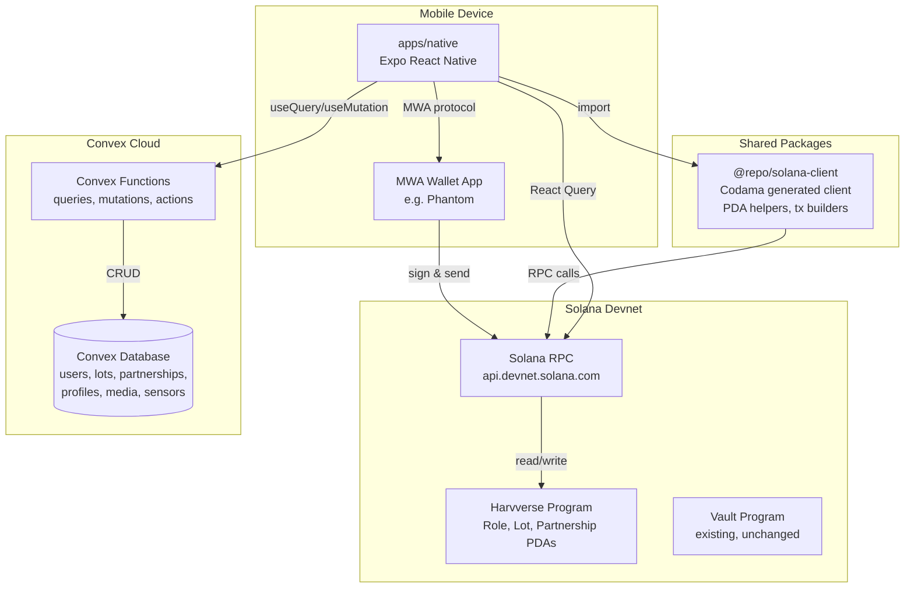
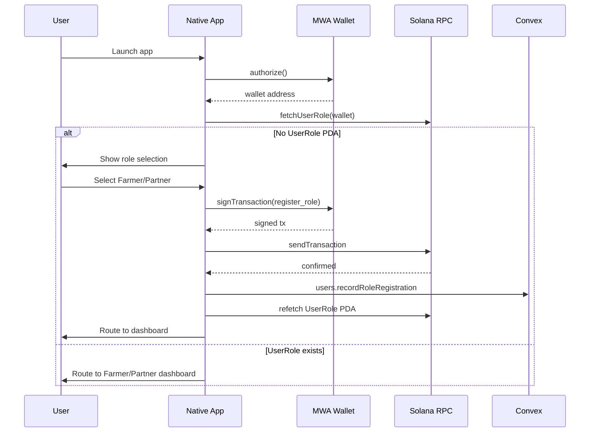
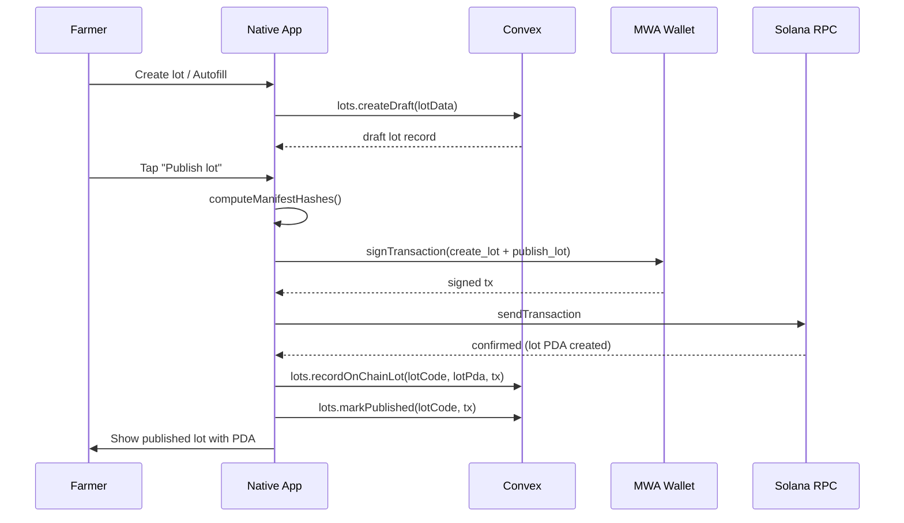
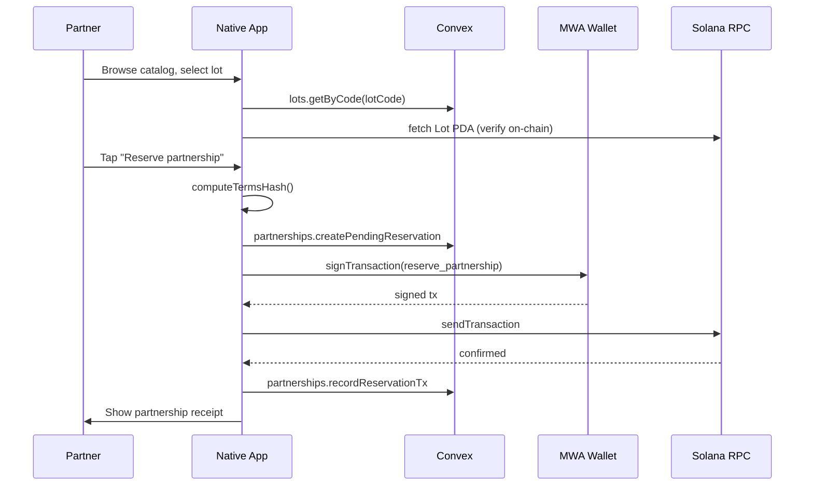

# Design Document: Solana Mobile App (Harvverse)

## Overview

This design covers the Harvverse Solana Mobile App — a hackathon deliverable implementing on-chain role registration, a coffee lot marketplace, and partnership settlement on Solana devnet. The system combines an Anchor program for on-chain state, a Convex backend for off-chain mutable data, and an Expo React Native Android app using Mobile Wallet Adapter (MWA).

**Key design decisions:**

1. **New `harvverse` program alongside existing `vault`** — The vault program remains untouched. A new `harvverse` program is added under `programs/anchor/programs/harvverse/` with its own program ID. This avoids breaking existing generated clients and allows independent deployment.

2. **Convex project at repo root** — A `convex/` directory at the workspace root, with its own `package.json` in the Turborepo workspace. The native app imports the Convex client directly.

3. **`@repo/solana-client` extended with Harvverse module** — Codama generates a `harvverse` client alongside the existing `vault` client under `src/generated/harvverse/`. PDA helpers and transaction builders are added as hand-written wrappers.

4. **State management: React Query + Convex subscriptions** — On-chain reads use React Query with manual invalidation after transactions. Off-chain reads use Convex's real-time subscriptions via `useQuery`.

5. **Transaction construction via `@solana/kit`** — All transactions are built using `@solana/kit` instruction builders from the Codama-generated client, then signed via MWA.

## Architecture



### Data Flow: Wallet Connect → Role Check → Routing



### Data Flow: Lot Creation → Publish



### Data Flow: Partnership Reservation



## Components and Interfaces

### Anchor Program Module Structure

```
programs/anchor/programs/harvverse/
├── Cargo.toml
└── src/
    ├── lib.rs                    # Program entry, declare_id!, mod declarations
    ├── state/
    │   ├── mod.rs
    │   ├── program_config.rs     # ProgramConfig account
    │   ├── user_role.rs          # UserRole account + RoleKind enum
    │   ├── farmer_profile.rs     # FarmerProfile account
    │   ├── partner_profile.rs    # PartnerProfile account
    │   ├── lot.rs                # Lot account + LotStatus enum
    │   ├── partnership.rs        # Partnership account + PartnershipStatus enum
    │   └── settlement_receipt.rs # SettlementReceipt account
    ├── instructions/
    │   ├── mod.rs
    │   ├── initialize_config.rs
    │   ├── register_role.rs
    │   ├── create_farmer_profile.rs
    │   ├── create_partner_profile.rs
    │   ├── create_lot.rs
    │   ├── publish_lot.rs
    │   ├── update_lot_hashes.rs
    │   ├── reserve_partnership.rs
    │   └── record_settlement.rs
    ├── errors.rs                 # HarvverseError enum
    └── events.rs                 # All program events
```

### Solana Client Package Structure

```
packages/solana-client/src/
├── index.ts                      # Re-exports all modules
├── generated/
│   ├── vault/                    # Existing vault client (unchanged)
│   └── harvverse/                # Codama-generated harvverse client
│       ├── index.ts
│       ├── accounts/
│       ├── instructions/
│       ├── types/
│       └── errors/
├── harvverse/
│   ├── index.ts                  # Re-exports PDA helpers + tx builders
│   ├── pda.ts                    # PDA derivation functions
│   ├── transactions.ts           # Transaction builder wrappers
│   ├── fetchers.ts               # Account fetch helpers
│   ├── hash.ts                   # Manifest hash computation
│   └── constants.ts              # Program ID, demo lot data
├── errors.ts                     # Existing
├── explorer.ts                   # Existing
├── lamports.ts                   # Existing
└── solana-client.ts              # Existing
```

### Solana Client Interfaces

```typescript
// packages/solana-client/src/harvverse/pda.ts
import { Address, getProgramDerivedAddress } from "@solana/kit";

export function deriveUserRolePda(wallet: Address): Promise<Address>;
export function deriveFarmerProfilePda(farmer: Address): Promise<Address>;
export function derivePartnerProfilePda(partner: Address): Promise<Address>;
export function deriveLotPda(
	farmer: Address,
	lotIdHash: Uint8Array,
): Promise<Address>;
export function derivePartnershipPda(
	lotPda: Address,
	partner: Address,
): Promise<Address>;
export function deriveSettlementReceiptPda(
	partnershipPda: Address,
): Promise<Address>;

// packages/solana-client/src/harvverse/fetchers.ts
import { Rpc, Address } from "@solana/kit";

export type UserRoleAccount = {
	wallet: Address;
	role: "farmer" | "partner";
	createdAt: bigint;
};

export function fetchUserRole(
	rpc: Rpc,
	wallet: Address,
): Promise<UserRoleAccount | null>;
export function fetchLot(rpc: Rpc, lotPda: Address): Promise<LotAccount | null>;
export function fetchPartnership(
	rpc: Rpc,
	partnershipPda: Address,
): Promise<PartnershipAccount | null>;

// packages/solana-client/src/harvverse/transactions.ts
import { Address, IInstruction } from "@solana/kit";

export type RegisterRoleInput = {
	wallet: Address;
	role: "farmer" | "partner";
};

export type CreateLotInput = {
	farmer: Address;
	lotIdHash: Uint8Array;
	metadataHash: Uint8Array;
	planHash: Uint8Array;
	mediaManifestHash: Uint8Array;
	sensorManifestHash: Uint8Array;
	ticketUsdcCents: bigint;
	farmerShareBps: number;
	partnerShareBps: number;
};

export type ReservePartnershipInput = {
	partner: Address;
	lotPda: Address;
	farmer: Address;
	termsHash: Uint8Array;
	ticketUsdcCents: bigint;
};

export function buildRegisterRoleInstruction(
	input: RegisterRoleInput,
): IInstruction;
export function buildCreateLotInstruction(input: CreateLotInput): IInstruction;
export function buildPublishLotInstruction(
	farmer: Address,
	lotPda: Address,
): IInstruction;
export function buildReservePartnershipInstruction(
	input: ReservePartnershipInput,
): IInstruction;
export function buildCreateFarmerProfileInstruction(
	farmer: Address,
	metadataHash: Uint8Array,
): IInstruction;
export function buildCreatePartnerProfileInstruction(
	partner: Address,
	metadataHash: Uint8Array,
): IInstruction;

// packages/solana-client/src/harvverse/hash.ts
export function computeManifestHash(
	payload: Record<string, unknown>,
): Uint8Array;
export function computeTermsHash(terms: {
	lotPda: string;
	farmerWallet: string;
	partnerWallet: string;
	ticketUsdcCents: number;
	farmerShareBps: number;
	partnerShareBps: number;
	metadataHash: string;
	planHash: string;
	timestamp: number;
}): Uint8Array;
```

### Expo Router File Structure

```
apps/native/app/
├── _layout.tsx                           # Root layout with AppProviders
├── index.tsx                             # Entry: redirect based on auth state
├── connect-wallet.tsx                    # Wallet connection screen
├── role-select.tsx                       # Role selection screen
├── (farmer)/
│   ├── _layout.tsx                       # Farmer tab/stack layout with role guard
│   ├── home.tsx                          # Farmer home dashboard
│   ├── lots/
│   │   ├── index.tsx                     # Farmer lots list
│   │   ├── new.tsx                       # Lot creation/editor
│   │   └── [lotCode]/
│   │       ├── edit.tsx                  # Edit existing lot
│   │       └── publish-review.tsx        # Publish review + sign
│   └── profile.tsx                       # Farmer profile creation
├── (partner)/
│   ├── _layout.tsx                       # Partner tab/stack layout with role guard
│   ├── home.tsx                          # Partner home dashboard
│   ├── catalog.tsx                       # Published lots catalog
│   ├── lots/
│   │   └── [lotCode]/
│   │       ├── index.tsx                 # Lot detail view
│   │       └── reserve.tsx              # Partnership reservation review + sign
│   └── partnerships/
│       └── [partnershipId]/
│           ├── index.tsx                 # Partnership receipt
│           └── settlement.tsx            # Settlement preview
└── +not-found.tsx                        # 404 fallback
```

### React Native Component Hierarchy

```
AppProviders
├── QueryClientProvider (React Query)
├── NetworkProvider (Solana cluster selection)
├── MobileWalletProvider (MWA connection)
├── ConvexProvider (Convex client)
└── RoleProvider (on-chain role state context)
    └── Stack/Tabs (expo-router)
```

### Hook Interfaces

```typescript
// hooks/useWalletRole.ts — fetches on-chain role after wallet connect
export function useWalletRole(): {
	role: "farmer" | "partner" | "unregistered" | null;
	rolePda: string | null;
	isLoading: boolean;
	error: Error | null;
	refetch: () => void;
};

// hooks/useRegisterRole.ts — constructs and sends register_role tx
export function useRegisterRole(): {
	registerRole: (role: "farmer" | "partner") => Promise<string>; // returns tx sig
	isPending: boolean;
	error: Error | null;
};

// hooks/useFarmerLots.ts — Convex subscription for farmer's lots
export function useFarmerLots(wallet: string): {
	lots: LotRecord[];
	isLoading: boolean;
};

// hooks/useCreateLot.ts — creates draft lot in Convex
export function useCreateLot(): {
	createDraft: (input: CreateLotDraftInput) => Promise<string>; // returns lotCode
	isPending: boolean;
};

// hooks/usePublishLot.ts — computes hashes, sends create_lot + publish_lot tx
export function usePublishLot(): {
	publishLot: (lotCode: string) => Promise<string>; // returns tx sig
	isPending: boolean;
	error: Error | null;
};

// hooks/usePublishedLots.ts — Convex subscription for published lots catalog
export function usePublishedLots(): {
	lots: LotRecord[];
	isLoading: boolean;
};

// hooks/useReservePartnership.ts — constructs and sends reserve_partnership tx
export function useReservePartnership(): {
	reserve: (input: ReserveInput) => Promise<string>; // returns tx sig
	isPending: boolean;
	error: Error | null;
};

// hooks/useLotOnChainVerification.ts — verifies Convex lot data against on-chain PDA
export function useLotOnChainVerification(lotPda: string | null): {
	isVerified: boolean;
	isLoading: boolean;
	onChainData: LotAccount | null;
};
```

### Convex Backend Structure

```
convex/
├── _generated/                   # Auto-generated by Convex CLI
├── schema.ts                     # Full schema definition
├── users.ts                      # User queries and mutations
├── lots.ts                       # Lot queries and mutations
├── partnerships.ts               # Partnership queries and mutations
├── farmerProfiles.ts             # Farmer profile mutations
├── partnerProfiles.ts            # Partner profile mutations
├── sensorSnapshots.ts            # Sensor snapshot mutations
├── agronomicPlans.ts             # Agronomic plan mutations
├── auditEvents.ts                # Audit event mutations
├── convex.config.ts              # App config (no agent component for this spec)
└── package.json                  # Convex dependencies
```

> **Note:** The AI Agent, x402 gateway, and chat functionality are explicitly excluded from this spec per the requirements document. The Convex schema and functions here cover only the tables and functions needed for the mobile app's core flows.

## Data Models

### On-Chain Account Definitions (Anchor/Rust)

#### ProgramConfig

```rust
// seeds = ["config"]
#[account]
pub struct ProgramConfig {
    pub authority: Pubkey,        // 32 bytes
    pub treasury: Pubkey,         // 32 bytes
    pub role_registration_enabled: bool, // 1 byte
    pub bump: u8,                 // 1 byte
}
// Space: 8 (discriminator) + 32 + 32 + 1 + 1 = 74 bytes
```

#### UserRole

```rust
#[derive(AnchorSerialize, AnchorDeserialize, Clone, PartialEq, Eq)]
pub enum RoleKind {
    Farmer,
    Partner,
}

// seeds = ["role", wallet]
#[account]
pub struct UserRole {
    pub wallet: Pubkey,          // 32 bytes
    pub role: RoleKind,          // 1 byte (enum)
    pub created_at: i64,         // 8 bytes
    pub bump: u8,                // 1 byte
}
// Space: 8 + 32 + 1 + 8 + 1 = 50 bytes
```

#### FarmerProfile

```rust
// seeds = ["farmer", farmer_wallet]
#[account]
pub struct FarmerProfile {
    pub farmer: Pubkey,              // 32 bytes
    pub display_name_hash: [u8; 32], // 32 bytes
    pub metadata_uri_hash: [u8; 32], // 32 bytes
    pub created_at: i64,             // 8 bytes
    pub bump: u8,                    // 1 byte
}
// Space: 8 + 32 + 32 + 32 + 8 + 1 = 113 bytes
```

#### PartnerProfile

```rust
// seeds = ["partner", partner_wallet]
#[account]
pub struct PartnerProfile {
    pub partner: Pubkey,             // 32 bytes
    pub display_name_hash: [u8; 32], // 32 bytes
    pub metadata_uri_hash: [u8; 32], // 32 bytes
    pub created_at: i64,             // 8 bytes
    pub bump: u8,                    // 1 byte
}
// Space: 8 + 32 + 32 + 32 + 8 + 1 = 113 bytes
```

#### Lot

```rust
#[derive(AnchorSerialize, AnchorDeserialize, Clone, PartialEq, Eq)]
pub enum LotStatus {
    Draft,
    Published,
    Reserved,
    InCycle,
    Settled,
    Cancelled,
}

// seeds = ["lot", farmer_wallet, lot_id_hash]
#[account]
pub struct Lot {
    pub farmer: Pubkey,                  // 32 bytes
    pub lot_id_hash: [u8; 32],           // 32 bytes
    pub metadata_hash: [u8; 32],         // 32 bytes
    pub plan_hash: [u8; 32],             // 32 bytes
    pub media_manifest_hash: [u8; 32],   // 32 bytes
    pub sensor_manifest_hash: [u8; 32],  // 32 bytes
    pub ticket_usdc_cents: u64,          // 8 bytes
    pub farmer_share_bps: u16,           // 2 bytes
    pub partner_share_bps: u16,          // 2 bytes
    pub status: LotStatus,               // 1 byte
    pub created_at: i64,                 // 8 bytes
    pub updated_at: i64,                 // 8 bytes
    pub bump: u8,                        // 1 byte
}
// Space: 8 + 32 + 32 + 32 + 32 + 32 + 32 + 8 + 2 + 2 + 1 + 8 + 8 + 1 = 230 bytes
```

#### Partnership

```rust
#[derive(AnchorSerialize, AnchorDeserialize, Clone, PartialEq, Eq)]
pub enum PartnershipStatus {
    Reserved,
    Active,
    Settled,
    Cancelled,
}

// seeds = ["partnership", lot_pda, partner_wallet]
#[account]
pub struct Partnership {
    pub lot: Pubkey,                 // 32 bytes
    pub farmer: Pubkey,              // 32 bytes
    pub partner: Pubkey,             // 32 bytes
    pub terms_hash: [u8; 32],        // 32 bytes
    pub ticket_usdc_cents: u64,      // 8 bytes
    pub status: PartnershipStatus,   // 1 byte
    pub reserved_at: i64,            // 8 bytes
    pub bump: u8,                    // 1 byte
}
// Space: 8 + 32 + 32 + 32 + 32 + 8 + 1 + 8 + 1 = 154 bytes
```

#### SettlementReceipt

```rust
// seeds = ["settlement", partnership_pda]
#[account]
pub struct SettlementReceipt {
    pub partnership: Pubkey,             // 32 bytes
    pub yield_qq: u16,                   // 2 bytes
    pub price_per_lb_cents: u16,         // 2 bytes
    pub revenue_usdc_cents: u64,         // 8 bytes
    pub cost_usdc_cents: u64,            // 8 bytes
    pub profit_usdc_cents: u64,          // 8 bytes
    pub farmer_share_usdc_cents: u64,    // 8 bytes
    pub partner_share_usdc_cents: u64,   // 8 bytes
    pub settlement_hash: [u8; 32],       // 32 bytes
    pub settled_at: i64,                 // 8 bytes
    pub bump: u8,                        // 1 byte
}
// Space: 8 + 32 + 2 + 2 + 8 + 8 + 8 + 8 + 8 + 32 + 8 + 1 = 125 bytes
```

### PDA Derivation Seeds

| Account           | Seeds                                      | Uniqueness Guarantee            |
| ----------------- | ------------------------------------------ | ------------------------------- |
| ProgramConfig     | `["config"]`                               | Singleton per program           |
| UserRole          | `["role", wallet]`                         | One role per wallet             |
| FarmerProfile     | `["farmer", farmer_wallet]`                | One profile per farmer          |
| PartnerProfile    | `["partner", partner_wallet]`              | One profile per partner         |
| Lot               | `["lot", farmer_wallet, lot_id_hash]`      | One lot per farmer+lot_id combo |
| Partnership       | `["partnership", lot_pda, partner_wallet]` | One partnership per lot+partner |
| SettlementReceipt | `["settlement", partnership_pda]`          | One settlement per partnership  |

### Program Events

```rust
#[event]
pub struct RoleRegistered {
    pub wallet: Pubkey,
    pub role: RoleKind,
    pub created_at: i64,
}

#[event]
pub struct LotCreated {
    pub lot: Pubkey,
    pub farmer: Pubkey,
    pub lot_id_hash: [u8; 32],
}

#[event]
pub struct LotPublished {
    pub lot: Pubkey,
    pub farmer: Pubkey,
    pub updated_at: i64,
}

#[event]
pub struct PartnershipReserved {
    pub partnership: Pubkey,
    pub lot: Pubkey,
    pub farmer: Pubkey,
    pub partner: Pubkey,
    pub ticket_usdc_cents: u64,
}

#[event]
pub struct SettlementRecorded {
    pub partnership: Pubkey,
    pub farmer_share_usdc_cents: u64,
    pub partner_share_usdc_cents: u64,
    pub settlement_hash: [u8; 32],
}
```

### Program Errors

```rust
#[error_code]
pub enum HarvverseError {
    #[msg("Role already registered for this wallet")]
    RoleAlreadyRegistered,

    #[msg("Wallet does not have the required role")]
    InvalidRole,

    #[msg("Farmer profile is required")]
    FarmerProfileMissing,

    #[msg("Partner profile is required")]
    PartnerProfileMissing,

    #[msg("Lot status does not allow this operation")]
    InvalidLotStatus,

    #[msg("Partnership status does not allow this operation")]
    InvalidPartnershipStatus,

    #[msg("Share basis points must sum to 10000")]
    InvalidShareSplit,

    #[msg("Hash field cannot be zero")]
    EmptyHash,

    #[msg("Settlement math does not match expected values")]
    InvalidSettlementMath,
}
```

### Convex Schema (TypeScript)

```typescript
// convex/schema.ts
import { defineSchema, defineTable } from "convex/server";
import { v } from "convex/values";

export default defineSchema({
	users: defineTable({
		wallet: v.string(),
		role: v.optional(v.union(v.literal("farmer"), v.literal("partner"))),
		rolePda: v.optional(v.string()),
		roleTx: v.optional(v.string()),
		createdAt: v.number(),
		updatedAt: v.number(),
	}).index("by_wallet", ["wallet"]),

	farmerProfiles: defineTable({
		wallet: v.string(),
		farmerProfilePda: v.optional(v.string()),
		displayName: v.string(),
		bio: v.optional(v.string()),
		country: v.optional(v.string()),
		region: v.optional(v.string()),
		metadataHash: v.string(),
		createdAt: v.number(),
		updatedAt: v.number(),
	}).index("by_wallet", ["wallet"]),

	partnerProfiles: defineTable({
		wallet: v.string(),
		partnerProfilePda: v.optional(v.string()),
		displayName: v.string(),
		organization: v.optional(v.string()),
		metadataHash: v.string(),
		createdAt: v.number(),
		updatedAt: v.number(),
	}).index("by_wallet", ["wallet"]),

	lots: defineTable({
		lotCode: v.string(),
		lotPda: v.optional(v.string()),
		farmerWallet: v.string(),
		status: v.union(
			v.literal("draft"),
			v.literal("published"),
			v.literal("reserved"),
			v.literal("in_cycle"),
			v.literal("settled"),
			v.literal("cancelled"),
		),
		farmName: v.string(),
		variety: v.string(),
		region: v.string(),
		country: v.string(),
		latitude: v.number(),
		longitude: v.number(),
		altitudeMeters: v.number(),
		areaManzanas: v.number(),
		ticketUsdcCents: v.number(),
		farmerShareBps: v.number(),
		partnerShareBps: v.number(),
		metadataHash: v.optional(v.string()),
		planHash: v.optional(v.string()),
		mediaManifestHash: v.optional(v.string()),
		sensorManifestHash: v.optional(v.string()),
		createdAt: v.number(),
		updatedAt: v.number(),
	})
		.index("by_lot_code", ["lotCode"])
		.index("by_farmer", ["farmerWallet"])
		.index("by_status", ["status"]),

	lotMedia: defineTable({
		lotCode: v.string(),
		storageId: v.string(),
		kind: v.union(
			v.literal("farm_photo"),
			v.literal("document"),
			v.literal("sensor_photo"),
		),
		caption: v.optional(v.string()),
		hash: v.string(),
		createdAt: v.number(),
	}).index("by_lot", ["lotCode"]),

	agronomicPlans: defineTable({
		lotCode: v.string(),
		planId: v.string(),
		planJson: v.any(),
		hash: v.string(),
		createdAt: v.number(),
	}).index("by_lot", ["lotCode"]),

	sensorSnapshots: defineTable({
		lotCode: v.string(),
		source: v.union(
			v.literal("demo_autofill"),
			v.literal("manual"),
			v.literal("iot_future"),
		),
		temperatureC: v.optional(v.number()),
		humidityPct: v.optional(v.number()),
		soilPh: v.optional(v.number()),
		soilMoisturePct: v.optional(v.number()),
		payload: v.any(),
		hash: v.string(),
		createdAt: v.number(),
	}).index("by_lot", ["lotCode"]),

	partnerships: defineTable({
		partnershipPda: v.optional(v.string()),
		lotCode: v.string(),
		lotPda: v.optional(v.string()),
		farmerWallet: v.string(),
		partnerWallet: v.string(),
		termsHash: v.string(),
		reserveTx: v.optional(v.string()),
		status: v.union(
			v.literal("pending"),
			v.literal("reserved"),
			v.literal("active"),
			v.literal("settled"),
			v.literal("cancelled"),
		),
		createdAt: v.number(),
		updatedAt: v.number(),
	})
		.index("by_partner", ["partnerWallet"])
		.index("by_lot", ["lotCode"]),

	auditEvents: defineTable({
		actorWallet: v.optional(v.string()),
		kind: v.string(),
		entityType: v.string(),
		entityId: v.string(),
		data: v.any(),
		createdAt: v.number(),
	}).index("by_entity", ["entityType", "entityId"]),
});
```

### Convex Function Signatures

#### Queries

```typescript
// convex/users.ts
export const getByWallet = query({
  args: { wallet: v.string() },
  returns: v.union(v.object({...}), v.null()),
  handler: async (ctx, { wallet }) => { /* ... */ },
});

// convex/lots.ts
export const listPublished = query({
  args: {},
  handler: async (ctx) => { /* returns lots with status "published" */ },
});

export const getByCode = query({
  args: { lotCode: v.string() },
  handler: async (ctx, { lotCode }) => { /* ... */ },
});

export const listByFarmer = query({
  args: { wallet: v.string() },
  handler: async (ctx, { wallet }) => { /* ... */ },
});

// convex/partnerships.ts
export const listByPartner = query({
  args: { wallet: v.string() },
  handler: async (ctx, { wallet }) => { /* ... */ },
});
```

#### Mutations

```typescript
// convex/users.ts
export const upsertAfterWalletConnect = mutation({
	args: { wallet: v.string() },
	handler: async (ctx, { wallet }) => {
		// Idempotent: create if not exists, update updatedAt if exists
	},
});

export const recordRoleRegistration = mutation({
	args: {
		wallet: v.string(),
		role: v.union(v.literal("farmer"), v.literal("partner")),
		rolePda: v.string(),
		roleTx: v.string(),
	},
	handler: async (ctx, args) => {
		/* ... */
	},
});

// convex/lots.ts
export const createDraft = mutation({
	args: {
		lotCode: v.string(),
		farmerWallet: v.string(),
		farmName: v.string(),
		variety: v.string(),
		region: v.string(),
		country: v.string(),
		latitude: v.number(),
		longitude: v.number(),
		altitudeMeters: v.number(),
		areaManzanas: v.number(),
		ticketUsdcCents: v.number(),
		farmerShareBps: v.number(),
		partnerShareBps: v.number(),
	},
	handler: async (ctx, args) => {
		/* creates lot with status "draft" */
	},
});

export const applyDemoAutofill = mutation({
	args: { lotCode: v.string() },
	handler: async (ctx, { lotCode }) => {
		/* applies Zafiro demo data */
	},
});

export const recordOnChainLot = mutation({
	args: { lotCode: v.string(), lotPda: v.string(), tx: v.string() },
	handler: async (ctx, args) => {
		/* records PDA and tx sig */
	},
});

export const markPublished = mutation({
	args: { lotCode: v.string(), tx: v.string() },
	handler: async (ctx, args) => {
		/* sets status to "published" */
	},
});

// convex/partnerships.ts
export const createPendingReservation = mutation({
	args: {
		lotCode: v.string(),
		lotPda: v.optional(v.string()),
		farmerWallet: v.string(),
		partnerWallet: v.string(),
		termsHash: v.string(),
	},
	handler: async (ctx, args) => {
		/* creates partnership with status "pending" */
	},
});

export const recordReservationTx = mutation({
	args: {
		partnershipId: v.id("partnerships"),
		partnershipPda: v.string(),
		tx: v.string(),
	},
	handler: async (ctx, args) => {
		/* records PDA, tx, sets status "reserved" */
	},
});
```

### Manifest Hash Computation Algorithm

The `computeManifestHash` function produces a deterministic SHA-256 hash from any JSON-serializable object using canonical JSON (sorted keys, no whitespace):

```typescript
// packages/solana-client/src/harvverse/hash.ts
import { createHash } from "crypto"; // or SubtleCrypto in browser/RN

/**
 * Produces a canonical JSON string by recursively sorting object keys.
 * Arrays preserve order. Primitives are serialized directly.
 */
function canonicalJson(obj: unknown): string {
	if (obj === null || typeof obj !== "object") {
		return JSON.stringify(obj);
	}
	if (Array.isArray(obj)) {
		return "[" + obj.map(canonicalJson).join(",") + "]";
	}
	const sorted = Object.keys(obj as Record<string, unknown>).sort();
	const entries = sorted.map(
		(key) =>
			JSON.stringify(key) +
			":" +
			canonicalJson((obj as Record<string, unknown>)[key]),
	);
	return "{" + entries.join(",") + "}";
}

/**
 * Computes SHA-256 hash of canonical JSON representation.
 * Returns 32-byte Uint8Array suitable for on-chain storage.
 */
export function computeManifestHash(
	payload: Record<string, unknown>,
): Uint8Array {
	const canonical = canonicalJson(payload);
	const encoder = new TextEncoder();
	const data = encoder.encode(canonical);
	// Use SubtleCrypto for React Native compatibility
	// Implementation uses react-native-quick-crypto or expo-crypto
	const hashBuffer = sha256(data); // platform-specific SHA-256
	return new Uint8Array(hashBuffer);
}
```

**Canonical JSON rules:**

1. Object keys are sorted lexicographically at every nesting level
2. No whitespace between tokens
3. Arrays preserve element order
4. Numbers use JSON default serialization (no trailing zeros)
5. Strings are JSON-escaped

This ensures that `computeManifestHash({ b: 1, a: 2 })` and `computeManifestHash({ a: 2, b: 1 })` produce identical hashes.
