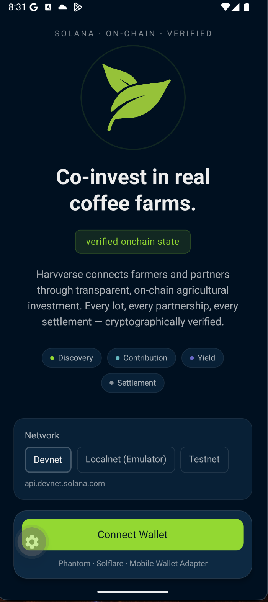
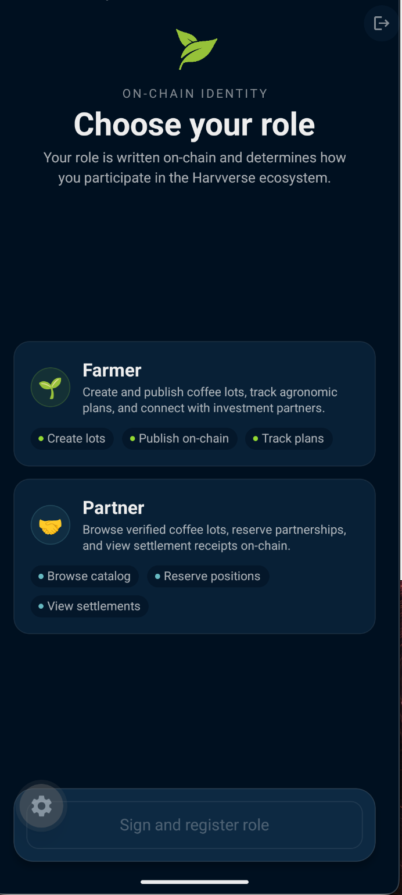
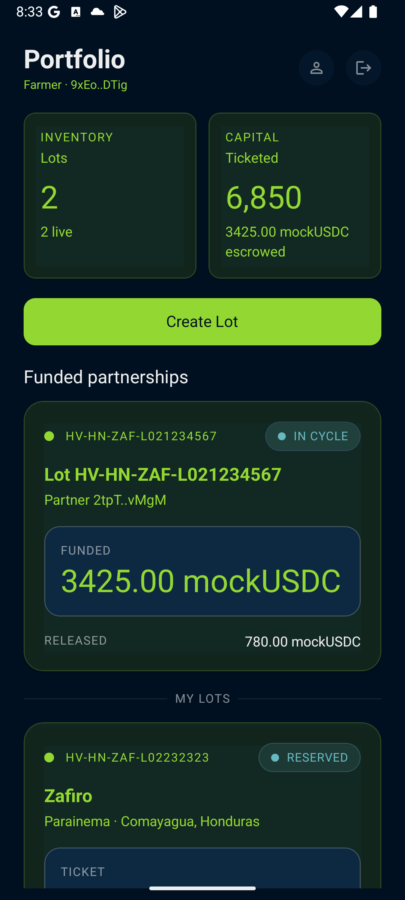
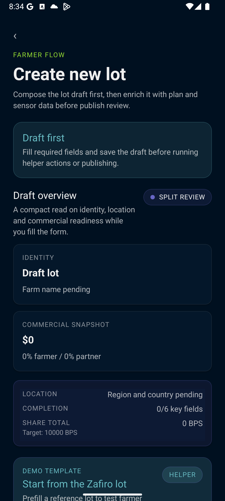
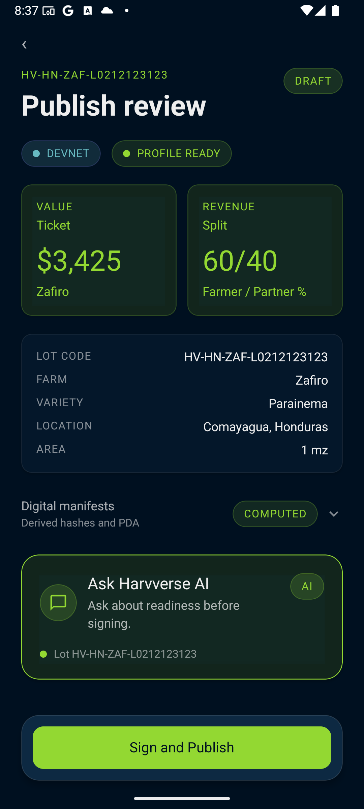
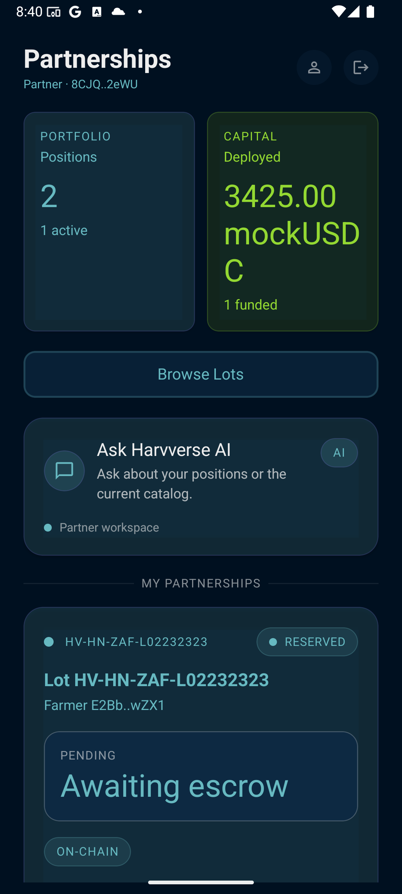
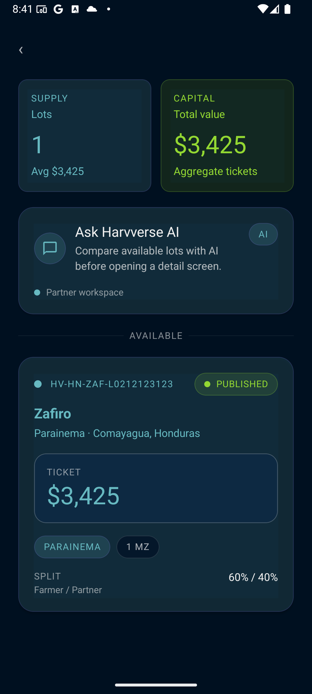
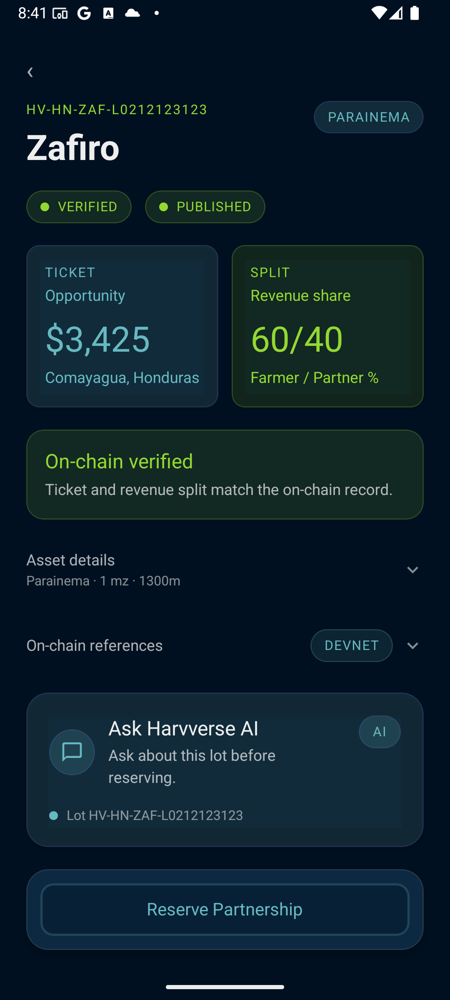
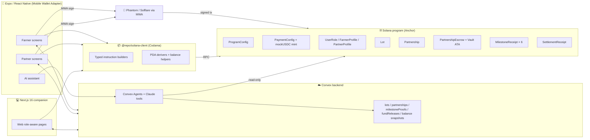

# Harvverse — Co-invest in real coffee farms, milestone by milestone

> **EasyA × Consensus 2026 — Miami Hackathon submission · Solana Mobile dApp Track**
>
> Harvverse is a mobile-first Solana dApp that lets coffee partners co-invest in
> real, GPS-verified Honduran coffee lots through a milestone-released `mockUSDC`
> escrow vault — with on-chain proof of every step from soil analysis to SCA
> cupping.

<p align="center">
  
</p>

<p align="center">
  <a href="#-demo-video">Demo&nbsp;Video</a> ·
  <a href="#-screens">Screens</a> ·
  <a href="#-how-the-blockchain-is-used">Blockchain</a> ·
  <a href="#-quickstart">Quickstart</a> ·
  <a href="#-end-to-end-demo-flow">Demo&nbsp;Flow</a> ·
  <a href="#-architecture">Architecture</a> ·
  <a href="#-roadmap">Roadmap</a>
</p>

---

## Table of Contents

- [The 30-second pitch](#-the-30-second-pitch)
- [Demo video](#-demo-video)
- [Screens](#-screens)
- [The problem we are solving](#-the-problem-we-are-solving)
- [Our solution](#-our-solution)
- [Why this is uniquely possible on Solana](#-why-this-is-uniquely-possible-on-solana)
- [How the blockchain is used](#-how-the-blockchain-is-used)
- [Tech stack](#-tech-stack)
- [Repository layout](#-repository-layout)
- [Quickstart](#-quickstart)
- [End-to-end demo flow](#-end-to-end-demo-flow)
- [Architecture](#-architecture)
- [Demo lot economics (Zafiro L02)](#-demo-lot-economics-zafiro-l02)
- [Security & demo constraints](#-security--demo-constraints)
- [Mapping to the judging criteria](#-mapping-to-the-judging-criteria)
- [Roadmap](#-roadmap)
- [Team](#-team)
- [License](#-license)

---

## ⚡ The 30-second pitch

Smallholder coffee farmers in Honduras grow some of the best beans in the world
but live one bad harvest away from selling future production at a discount.
Investors who would happily back them have no transparent, verifiable way to do
it.

**Harvverse closes the gap with a Solana-native escrow.** A Partner funds the
**exact** ticket of an agronomic plan in `mockUSDC`. Funds sit in a
program-controlled vault. As the Farmer completes each of six agronomic
milestones — diagnosis, pruning, fertilization, sanitation, pre-harvest, and
beneficiation — proof hashes are recorded on-chain and the next tranche is
released to the Farmer's wallet automatically. No middleman. No "trust me"
PDFs. Just verifiable, milestone-released capital.

A real farm. A real plan. A real Solana program. A real demo, in your hand.

---

## 🎬 Demo video

> **Short demo:** the full faucet → fund → record proof → release flow.

<p align="center">
  <a href="https://youtu.be/7dxmFQjrGzM">
    
  </a>
</p>

<p align="center">
  ▶ <a href="https://youtu.be/7dxmFQjrGzM"><strong>Watch the demo on YouTube</strong></a>
</p>

> **Loom walkthrough (with audio):** repo tour, Anchor program walkthrough, and
> live demo on devnet.

<p align="center">
  ▶ <a href="https://www.loom.com/share/f1a3b3e0fa7e4cbfa5ffaf3184163346"><strong>Watch the Loom walkthrough</strong></a>
</p>

> **Pitch deck (Canva):**

<!-- TODO: replace with Canva share link -->

```

```

---

## 🖼️ Screens
### 1. Onboarding · Connect Wallet & Pick Role

|                                    Connect Wallet                                    |                                         Role Select                                         |
| :----------------------------------------------------------------------------------: | :-----------------------------------------------------------------------------------------: |
|                             |                                          |
| `apps/native/app/connect-wallet.tsx` — animated logo, network selector, MWA connect. | `apps/native/app/role-select.tsx` — register `Farmer` or `Partner` `UserRole` PDA on-chain. |

### 2. Farmer flow · Lot Authoring

|                            Farmer Home                             |                                    Create Lot                                    |                                          Publish Review                                           |
| :----------------------------------------------------------------: | :------------------------------------------------------------------------------: | :-----------------------------------------------------------------------------------------------: |
|                 |                          |                                   |
| `apps/native/app/(farmer)/home.tsx` — lots, KPIs, escrowed totals. | `apps/native/app/(farmer)/lots/new.tsx` — Convex draft with hashed plan + media. | `apps/native/app/(farmer)/lots/[lotCode]/publish-review.tsx` — call `create_lot` + `publish_lot`. |

### 3. Partner flow · Discover, Reserve, Fund

|                                Partner Home                                |                                      Catalog                                       |                                         Lot Detail                                         |
| :------------------------------------------------------------------------: | :--------------------------------------------------------------------------------: | :----------------------------------------------------------------------------------------: |
|                       |                                 |                                   |
| `apps/native/app/(partner)/home.tsx` — funded partnerships + AI assistant. | `apps/native/app/(partner)/catalog.tsx` — browse published lots from Convex + RPC. | `apps/native/app/(partner)/lots/[lotCode]/index.tsx` — full agronomic plan, hashes, media. |

---

## 😡 The problem we are solving

Coffee is a **$200B+ retail market** built on the back of ~25M smallholder
producers, the majority of whom never see more than a few dollars per pound.
Three structural problems make capital expensive for them:

1. **Information asymmetry.** Buyers, banks, and investors do not trust
   farmer-reported yields, costs, or quality. Audits are expensive and rare.
2. **Capital that arrives late or never.** Inputs (fertilizer, fungicide,
   labor) are needed _before_ harvest. Loans and contracts pay _after_.
3. **No verifiable trail.** EU Deforestation Regulation (EUDR) and specialty
   buyers are demanding GPS, traceability, and audit trails that paper-based
   smallholders cannot produce.

The result: farmers borrow at 30%+ interest from coyotes, lose upside to
middlemen, and never accumulate capital.

---

## ✅ Our solution

Harvverse is a mobile-first dApp where:

- **Farmers** create a verifiable lot with GPS, variety, altitude, an
  agronomic plan (6 milestones), media, and IoT-ready sensor manifest. Each
  document is hashed to Solana on `create_lot` / `publish_lot`.
- **Partners** browse published lots, mint demo `mockUSDC` from an in-app
  faucet, and **fund the exact ticket** into a program-controlled escrow PDA.
  Off-by-one cents = transaction rejected on-chain.
- **The Solana program** (1) holds the funds, (2) releases an explicit kickoff
  tranche so the Farmer has working capital for M1+M2, (3) releases each
  subsequent tranche only after the corresponding milestone proof hash has been
  recorded.
- **Convex** mirrors the human-readable proof content (captions, photos, GPS
  text, receipt notes, IoT payloads) and serves the in-app AI assistant.
- **Solana RPC** is the single source of truth for token balances. The UI
  refreshes live balances after every faucet, fund, proof, and release tx.

The result for the Partner: they can _see_ the vault drain milestone by
milestone, with a transaction signature tied to each release. The result for
the Farmer: predictable, on-time working capital that never depends on a phone
call to a middleman.

---

## 🧠 Why this is uniquely possible on Solana

| Capability we needed                          | Why Solana                                                                                                                             |
| --------------------------------------------- | -------------------------------------------------------------------------------------------------------------------------------------- |
| Sub-second confirmation for in-person UX      | Solana's ~400 ms block time means the Partner watches the vault balance update _during_ the demo, not minutes later.                   |
| Cents-cheap fees so M1…M6 releases are viable | Five+ token transfers per partnership at fractions of a cent each is only sustainable on a high-throughput L1.                         |
| Native mobile wallet UX                       | **Mobile Wallet Adapter** + Solana Mobile Stack let us ship a real Phantom/Solflare flow on Android in three days.                     |
| First-class typed clients                     | **Anchor IDL → Codama** generates a strongly typed TS client we share between Expo and Next.js without hand-rolling fetchers.          |
| Token + program composability                 | We mint a Harvverse-controlled `mockUSDC` SPL token in the same program that owns the escrow PDA — one IDL, one client, one deploy.    |
| PDAs as deterministic, key-less custodians    | The escrow vault has _no_ private key. Funds can only move out via program CPI signer seeds — perfect for a trust-minimized custodian. |

We deliberately did **not** use cross-chain bridges, oracles, or rollups for
P0. Every dollar of trust we need is enforced by a single Solana program with
testable, tightly-scoped instructions.

---

## 🔗 How the blockchain is used

The Anchor program is deployed on devnet (and mirrored on localnet) at the
canonical program ID:

```text
Bwedfg1JZvA5HfV5dCA2cyJhQf2Bkbop6K8eMdt1vKWP
```

Devnet PDAs (already initialized for the demo):

```text
ProgramConfig PDA:        74tYJV5VngQcT8VAEkXrq7dvqzSZm25SouK9PDKS5opx
PaymentConfig PDA:        GZDzaWCZwzfSfvpCqgscWNtKECWy1HG9ZrGyfrBWPgVj
mockUSDC mint:            8wQSbMJyTwumv4z3mJs3JUdZAhaqkGy9mUhtAMUiuWNj
mockUSDC mint authority:  7vqjvayzNxu3UmchXt6D7tQ6FU8FCh4iduHvYi3fXeL4
Faucet amount:            5,000.000000 mockUSDC
```

### On-chain accounts

| Account             | Purpose                                                                                     |
| ------------------- | ------------------------------------------------------------------------------------------- |
| `ProgramConfig`     | Treasury wallet, pause switch, version.                                                     |
| `PaymentConfig`     | mockUSDC mint, decimals, faucet amount, mint authority bump.                                |
| `UserRole`          | Wallet ↔ Farmer/Partner role binding.                                                       |
| `FarmerProfile`     | Hashed display name + metadata URI.                                                         |
| `PartnerProfile`    | Hashed display name + organization.                                                         |
| `Lot`               | Status, ticket cents, share basis points, plan/media/sensor hashes, GPS.                    |
| `Partnership`       | Farmer ↔ Partner ↔ Lot link with terms hash.                                                |
| `PartnershipEscrow` | Vault token account, deposited/released amounts, six release tranche slots, release bitmap. |
| `MilestoneReceipt`  | Per-milestone proof hash and recorder.                                                      |
| `SettlementReceipt` | Final yield × price × split snapshot.                                                       |

### Instructions (full list)

```rust
// programs/anchor/programs/harvverse/src/lib.rs
initialize_config            // bootstrap ProgramConfig
register_role                // farmer | partner
create_farmer_profile
create_partner_profile
create_lot                   // hashes + ticket cents + share split
publish_lot                  // draft → published
update_lot_hashes            // rotate metadata before publish
initialize_mock_usdc         // one-time mint + PaymentConfig setup
claim_mock_usdc              // demo faucet (devnet/localnet only)
reserve_partnership          // ↑ TRANSFER FULL TICKET INTO VAULT
record_milestone             // hash proof for milestone N
release_kickoff_funds        // M1+M2 working-capital tranche
release_milestone_funds      // unlock next tranche given prior proof
record_settlement            // final 60/40 receipt
```

### Release rule (the heart of the demo)

|    Release index | Trigger                   | Amount (`mockUSDC`) |
| ---------------: | ------------------------- | ------------------: |
|      0 (kickoff) | Funded partnership active |              380.00 |
|                1 | M2 proof recorded         |              225.00 |
|                2 | M3 proof recorded         |              175.00 |
|                3 | M4 proof recorded         |              210.00 |
|                4 | M5 proof recorded         |              460.00 |
| 5 (IoT/closeout) | M6 proof recorded         |               40.00 |

After all releases, **1,490 mockUSDC** has flowed to the Farmer and
**1,935 mockUSDC** is held reserve (contingency, platform fee, working
capital). The held reserve is **explicitly labeled** in the UI — judges should
not confuse it with Partner profit. Profit settlement happens in a separate
revenue vault (P1, see [roadmap](#-roadmap)).

### What the program enforces (negative tests pass)

- ❌ Wrong ticket value → reservation rejected.
- ❌ Insufficient `mockUSDC` → reservation rejected.
- ❌ Release without the required prior milestone proof → rejected.
- ❌ Duplicate release of the same tranche → rejected.
- ❌ Non-farmer trying to record a proof → rejected.
- ❌ Arbitrary mint substituted for `mockUSDC` → rejected.
- ❌ PDA signer-seed mismatch on vault transfer → rejected.

---

## 🛠️ Tech stack

| Layer                 | Tech                                                                                                    |
| --------------------- | ------------------------------------------------------------------------------------------------------- |
| Smart contract        | **Anchor 0.30** (Rust) + `anchor-spl` (token + associated_token)                                        |
| Program ID            | `Bwedfg1JZvA5HfV5dCA2cyJhQf2Bkbop6K8eMdt1vKWP` (devnet + localnet)                                      |
| Generated TS client   | **Codama** + `@solana/kit` — typed instructions, accounts, PDAs, errors                                 |
| Demo stable token     | Harvverse-minted `mockUSDC` SPL Token (6 decimals, PDA mint authority)                                  |
| Mobile app            | **Expo SDK 54 / React Native** + **Mobile Wallet Adapter** + `@wallet-ui/react-native-kit` + Reanimated |
| Web companion         | **Next.js 16** App Router + Tailwind + Wallet Standard                                                  |
| Off-chain data        | **Convex** (lots, plans, media, milestone proofs, fund releases, balance snapshots, audit events)       |
| AI assistant          | **Convex Agents** + **Anthropic Claude** (grounded tools: lot, partnership, sensor snapshots, timeline) |
| Wallet UX             | Phantom / Solflare on Android via Mobile Wallet Adapter                                                 |
| Build / orchestration | **Turborepo** + **pnpm** workspaces                                                                     |

---

## 📁 Repository layout

```
harvverse-miami-tracks/
├── apps/
│   ├── native/                # Expo React Native Android dApp (primary)
│   │   ├── app/               # expo-router screens, grouped by role
│   │   ├── components/        # UI kit (Button, Card, MetricCard, …)
│   │   ├── features/          # role / wallet / partner / farmer / agent
│   │   └── theme/             # design tokens, typography, colors
│   └── web/                   # Next.js 16 companion dApp
│       └── app/               # role-aware app router pages
├── programs/
│   └── anchor/                # Anchor workspace
│       └── programs/harvverse # core Solana program (this is the heart)
├── packages/
│   ├── backend/               # Convex backend (schema, mutations, queries, agents)
│   ├── solana-client/         # Codama-generated client + hand-written helpers
│   └── ui/                    # shared RN UI primitives
├── plans/                     # design docs (consensus brief, agronomic plan, escrow spec)
├── scripts/                   # localnet-dev orchestrator, airdrop helpers
└── README.md                  # ← you are here
```

Pointer files worth opening during judging:

- [`programs/anchor/programs/harvverse/src/lib.rs`](programs/anchor/programs/harvverse/src/lib.rs) — every program entrypoint.
- [`programs/anchor/programs/harvverse/src/instructions/reserve_partnership.rs`](programs/anchor/programs/harvverse/src/instructions/reserve_partnership.rs) — funded reservation logic.
- [`programs/anchor/programs/harvverse/src/instructions/release_milestone_funds.rs`](programs/anchor/programs/harvverse/src/instructions/release_milestone_funds.rs) — milestone-gated release.
- [`packages/solana-client/src/harvverse/transactions.ts`](packages/solana-client/src/harvverse/transactions.ts) — typed builders shared by web + native.
- [`packages/backend/convex/schema.ts`](packages/backend/convex/schema.ts) — off-chain mirror schema.
- [`apps/native/app/(partner)/lots/[lotCode]/reserve.tsx`](<apps/native/app/(partner)/lots/[lotCode]/reserve.tsx>) — fund + reserve UX.
- [`apps/native/app/(farmer)/partnerships/[partnershipId]/index.tsx`](<apps/native/app/(farmer)/partnerships/[partnershipId]/index.tsx>) — milestone proof + release UX.
- [`plans/agrichultural-plan.md`](plans/agrichultural-plan.md) — the real agronomic plan that powers the demo lot.
- [`plans/mock-usdc-escrow-milestones.md`](plans/mock-usdc-escrow-milestones.md) — the engineering spec we executed against.

---

## 🚀 Quickstart

### Prerequisites

```bash
node --version    # ≥ 18
pnpm --version    # ≥ 10
rustc --version   # latest stable
solana --version  # 1.18+
anchor --version  # 0.30+
# Android: JDK 17 + Android Studio + an emulator OR a physical device with Phantom/Solflare
```

### Install

```bash
git clone <this repo>
cd harvverse-miami-tracks
pnpm install
```

### Configure Convex

```bash
pnpm convex:setup
# Copy CONVEX_URL into:
#   apps/web/.env.local     -> NEXT_PUBLIC_CONVEX_URL=...
#   apps/native/.env.local  -> EXPO_PUBLIC_CONVEX_URL=...
```

### Build the program & generate the typed client

```bash
pnpm anchor:build
pnpm codama:js
```

### Option A · Try it on devnet (fastest, recommended for judging)

The program, `ProgramConfig`, and `mockUSDC` are **already deployed and
initialized on devnet**. Just run the apps:

```bash
# Terminal 1 — Convex
pnpm dev:convex

# Terminal 2 — mobile (Expo dev client / Android)
pnpm dev:native        # or: pnpm android

# Terminal 3 (optional) — web companion
pnpm dev:web
```

In the app, pick **Devnet** in the network selector.

### Option B · Full local validator (resettable)

```bash
# One command spins up validator + deploys + initializes config + mockUSDC + apps
pnpm dev:local              # web
pnpm dev:local:android      # native (Android emulator)
```

This script starts `solana-test-validator`, runs Codama codegen, deploys the
canonical program ID, initializes `ProgramConfig` and `PaymentConfig`, and
launches the apps. See [`LOCAL-DEV.md`](LOCAL-DEV.md) for the full breakdown.

### Verification

```bash
pnpm typecheck
pnpm lint
pnpm anchor:test
pnpm ci   # full CI-equivalent locally
```

---

## 🎯 End-to-end demo flow

This is the exact flow we run on stage. Total time: **≤ 4 minutes**.

> Detailed step-by-step (with negative tests) lives in
> [`plans/mock-usdc-escrow-mobile-test-guide.md`](plans/mock-usdc-escrow-mobile-test-guide.md).

### 0. Setup (already done before the demo starts)

- Devnet wallets for **Farmer** and **Partner** are funded with ~2 SOL each.
- Farmer has registered the `Farmer` role and published the **HV-HN-ZAF-L02**
  Zafiro lot.

### 1. Partner connects (~10 s)

Open the app, pick **Devnet**, tap **Connect Wallet**, approve in Phantom.
The app routes to either `(partner)/home` or `role-select` based on the
on-chain `UserRole` PDA.

→ **Screenshot:** [`docs/screenshots/01-connect-wallet.png`](docs/screenshots/01-connect-wallet.png)

### 2. Partner mints `mockUSDC` (~10 s)

In the Zafiro lot reserve screen, tap **Get mockUSDC**. The app builds a
single transaction with an idempotent ATA create + `claim_mock_usdc` and signs
it via MWA. After confirmation, the live balance jumps **+5,000.00 mockUSDC**.

→ **Screenshot:** [`docs/screenshots/09-partner-reserve-faucet.png`](docs/screenshots/09-partner-reserve-faucet.png)

### 3. Partner funds the escrow (~20 s)

Type `3425.00`, hit **Sign, fund, and reserve**. The program:

1. Validates `ticket_usdc_cents == lot.ticket_usdc_cents`.
2. Creates the `Partnership` and `PartnershipEscrow` PDAs.
3. Creates the vault ATA owned by the vault authority PDA.
4. `transfer_checked` 3,425 mockUSDC from Partner ATA → vault ATA.

The UI immediately shows **Partner −3,425 / Vault +3,425**.

→ **Screenshot:** [`docs/screenshots/10-partner-reserve-fund.png`](docs/screenshots/10-partner-reserve-fund.png)

### 4. Farmer releases kickoff funds (~10 s)

Switch to the Farmer wallet, open the funded partnership, tap **Release
Kickoff**. Vault drops to **3,045**, Farmer ATA gains **+380** mockUSDC.

→ **Screenshot:** [`docs/screenshots/14-farmer-release-funds.png`](docs/screenshots/14-farmer-release-funds.png)

### 5. Farmer records M2 proof + releases M3 (~30 s)

Fill caption / GPS / receipt for M2, tap **Record M2 proof**. The app hashes
the payload, calls `record_milestone`, and stores the human-readable text in
Convex with a Solana tx signature.

Tap **Release M3 funds**. Vault → **2,820**, Farmer **+225**.

→ **Screenshots:** [`docs/screenshots/13-farmer-record-proof.png`](docs/screenshots/13-farmer-record-proof.png) · [`docs/screenshots/14-farmer-release-funds.png`](docs/screenshots/14-farmer-release-funds.png)

### 6. (Speed run) M3 → M4 → M5 → M6 → IoT (~60 s)

Repeat the proof + release pattern. By the end of the run:

```text
Farmer released total: 1,490.00 mockUSDC
Vault balance:          1,935.00 mockUSDC
Held reserve label:     "Held reserve · contingency + working capital"
```

### 7. Partner double-checks the trail (~15 s)

Back to the Partner partnership detail view. Every milestone shows a tx hash
linking to **Solana Explorer**. Click one. Real on-chain transfer. Real PDA
custody. Real demo.

→ **Screenshots:** [`docs/screenshots/15-partner-partnership.png`](docs/screenshots/15-partner-partnership.png) · [`docs/screenshots/18-explorer.png`](docs/screenshots/18-explorer.png)

### 8. Negative tests on demand (judging Q&A)

If a judge asks _"can the Partner pay less?"_ or _"can the Farmer release
twice?"_ — we ship the wrong amount or click the same release twice. The
program rejects, the UI surfaces the error, the vault is untouched.

---

## 🏛️ Architecture



Three principles guided the design:

1. **Solana is the source of truth for value and custody.** Token balances,
   escrow custody, and milestone proof hashes live on-chain.
2. **Convex is the source of truth for human-readable proof content.**
   Captions, photos, GPS text, IoT payloads, and audit timeline all live in
   Convex with hashes that are checkable against on-chain records.
3. **The mobile app is wallet-driven.** Every state-changing action is a
   transaction the user signs in their wallet — the AI agent never signs.

---

## 💰 Demo lot economics (Zafiro L02)

The demo lot is **Finca Zafiro**, the personal farm of the Harvverse CEO,
validated by his father — a Cup of Excellence Honduras 2013 World Champion
(92.75 pts). The full agronomic plan lives at
[`plans/agrichultural-plan.md`](plans/agrichultural-plan.md).

```text
Lot code:                HV-HN-ZAF-L02
Variety:                 Parainema (Sarchimor — rust resistant)
Altitude:                1,300 msnm (Strictly High Grown)
Area:                    1.0 manzana (~0.7 ha)
Profile:                 C-Premium (4 fertilizations, IoT, beneficiation control)

Ticket:                  $3,425.00  (342_500 cents · 3,425_000_000 base units)
Direct agronomic plan:   $1,450.00
IoT service:               $40.00
Contingency + fee:        $313.00
Working capital reserve: $1,622.00

Profit split:            Farmer 60% / Partner 40% (on ALL profit, no cap)
Price:                   $3.50/lb fixed, $2.50/lb floor
Phygital deliverable:    5 lb specialty roast, January 2027
```

---

## 🔒 Security & demo constraints

- ✅ The vault authority is a PDA. **No private key exists** for the escrow.
- ✅ Every fund-moving instruction validates mint, decimals, owner, and PDA
  signer seeds.
- ✅ Release amounts are checked to never exceed the deposited ticket.
- ✅ The faucet is **only ever called on devnet/localnet** and is clearly
  labelled "demo-only" in the UI.
- ✅ The AI agent has **read-only** Solana/Convex access. It never holds keys
  and never co-signs user transactions.
- ⚠️ `mockUSDC` is not USDC. It is a Harvverse-controlled SPL token whose
  symbol mirrors USDC for the demo only. Mainnet would swap in real USDC by
  changing the configured mint and removing the faucet (see
  [`plans/mock-usdc-escrow-milestones.md §13`](plans/mock-usdc-escrow-milestones.md)).
- ⚠️ Settlement is currently a receipt only. Profit distribution from real
  coffee revenue is the P1 `RevenueEscrow` (see [roadmap](#-roadmap)).

---

## 🏆 Mapping to the judging criteria

| Criterion             | How Harvverse scores                                                                                                                                                                                   |
| --------------------- | ------------------------------------------------------------------------------------------------------------------------------------------------------------------------------------------------------ |
| **Execution**         | Live on devnet today. Mobile-first UX with animated, themed components. End-to-end flow runs in under 4 minutes from a cold wallet. Live RPC balances after every tx — judges _see_ it work.           |
| **Usefulness**        | Backed by a real agronomic plan, real farm, real producer (Cup of Excellence champion validation). Solves a structural smallholder-finance problem worth billions globally.                            |
| **Learning**          | Built from scratch in 3 days: new Anchor escrow + token program, MWA mobile flow, Codama-typed shared client, Convex schema + Agents, and a milestone state machine. Real Rust, real Solana.           |
| **Use of blockchain** | The blockchain isn't decoration — it's the trust layer. PDA-custodied vault, milestone-gated CPI transfers, on-chain proof hashes, on-chain settlement receipt, on-chain role/profile binding.         |
| **Deployment**        | `Bwedfg1JZvA5HfV5dCA2cyJhQf2Bkbop6K8eMdt1vKWP` is **deployed and initialized on devnet** with `ProgramConfig`, `PaymentConfig`, and `mockUSDC` ready. Localnet works one-command via `pnpm dev:local`. |

Submission requirements (from `plans/consensus.md`):

- ✅ Built on Solana
- ✅ Open source (this repo)
- ✅ Short summary (top of this README)
- ✅ Full description (see [Problem](#-the-problem-we-are-solving) +
  [Solution](#-our-solution))
- ✅ Technical description (see [Tech stack](#-tech-stack) +
  [Blockchain](#-how-the-blockchain-is-used))
- ⏳ Canva slides — _link added before submission_
- ✅ README with screenshots, demo video, and Loom — this document

---

## 🛣️ Roadmap

| Phase                   | Scope                                                                                                                                                 |
| ----------------------- | ----------------------------------------------------------------------------------------------------------------------------------------------------- |
| **P0 (this hackathon)** | Mobile dApp · Anchor program · `mockUSDC` escrow · 6-milestone release · Convex mirror · AI assistant · devnet deployment.                            |
| **P1**                  | `RevenueEscrow` for real 60/40 profit settlement from coffee sale proceeds · upload pipeline for milestone photos · push notifications.               |
| **P2**                  | Real USDC on mainnet (swap mint, remove faucet) · IoT integration via SIUCOM-ProduceMás (LoRaWAN climate + soil + fermentation pH) anchored to chain. |
| **P3**                  | Chainlink Price Feeds for dynamic coffee price · EUDR-compliant traceability export · multi-lot Partner portfolio.                                    |
| **P4**                  | Token-2022 with transfer hooks for jurisdiction enforcement · DAO governance for `ProgramConfig` (treasury, faucet enable/disable, fee schedule).     |

---

---

## 📄 License

This project is open source under the **MIT License** (see `LICENSE` file when
added). Submitted to the EasyA × Consensus 2026 Miami Hackathon — Solana
Mobile dApp Track.

---

<p align="center">
  <em>Built in Miami. Grown in Comayagua. Verified on Solana.</em>
</p>
